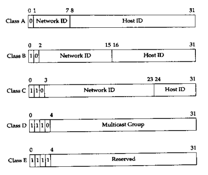
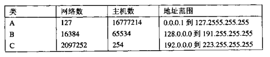

#技巧2 理解子网和CIDR
##分类地址
通常情况下，IP地址分为5个类。这种分割称作分类地址。

D类地址用于多点广播地址，E类地址为将来使用而保留。剩下来的A类地址、B类地址和C类地址用于标识单个的网络和主机。

一个地址的分类是以开始的为1的位的个数来标识的。A类地址的开头有0个为1的位，B类地址的开头有1个为1的位，C类地址有两个，以此类推。因为余下来的位的解释依赖于地址的类别，所以标识地址的类别是很重要的。

A类地址、B类地址和C类地址的生下来的位分成两部分。第一部分是网络ID，它标识该地址所指向的特定网络。在这之后是主机ID，它标识网络中的一台特定的主机。

把地址空间分为几类的原因是为了在不浪费地址空间的情况下尽可能地提供灵活性。例如，A类地址用于具有大量主机（16777214）的网络。因为网络ID为7位，所以总共有128个A类网络。

跟A类网络对应的是C类网络。C类网络的数量很多，但是每一个都只有254个可获得的主机ID。二者相反的是，A类地址意味着包含大量主机的很少的网络，C类地址意味着包含很少主机的大量网络。

