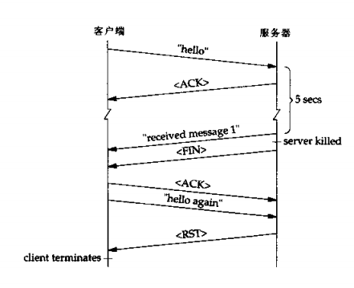
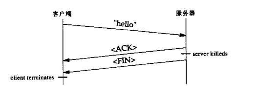

#技巧9 注意TCP是可靠的协议 但并非是不会出错的协议
##可靠性——什么是可靠性，什么不是可靠性
接收方TCP将会对发送方的TCP做出保证，该保证就是它确认的任何数据以及在它之前到达的所有数据在TCP层上已经正确地接收到了，然后发送方TCP可以安全地丢弃数据的拷贝。这并不意味着该数据已经传递给应用程序了，也不意味着它一定会传递到。发送方应用程序并没有单独告诉TCP数据是否被对等方应用程序实际接收到了。

##失败模式
我们已经看到前面给出的一种失败模式：TCP确认的数据实际上有可能不会到达它的目的应用程序。正如我们将要讨论的大多数失败模式一样，这是一个相对少见的事件，即使当它发生时，影响也可能是良性的。重要的是，网络程序员能意识到这种可能性，能够在这种情况或任何其他的失败模式出现不愿看到的结果时保护应用程序。

对于前面讨论的失败模式，解决方法是显而易见的。如果应用程序知道对等方已经接收到了一个特定的消息这事确实很重要，那么对等方就必须通知发送方这个事实。

更困难的一个问题是，如果服务器不确认接收到了数据，客户端将会做什么呢？仅仅是重新发送请求并不总是可以接受的。数据库系统使用三阶段提交协议来处理这种类型的问题，一些应用程序可以借用这个策略来保证操作“至多执行一次”。这种协议的一个例子就是OSI参考栈的应用程序层中提供的一般应用程序服务元素（CASE）的并发、提交和恢复（concurrency, commitment, and recovery, CCR）服务。

TCP是一个终端点到终端点的协议，这意味着通信的双方只关心自己提供了一个可靠的传输机制。然而，认识到“终端点”是对等双方的TCP层而不是对等的应用程序是很重要的。需要终端到终端确认的应用程序必须自己提供。

看一下其他“通常”的失败模式。只要双方保持连接，TCP就能保证按顺序递交数据并且数据不会被破坏。只有当连接中断时失败故障才会发生。发生中断的情况有三个：

（1）可能发生永久的或暂时的网络紊乱。

（2）对等方的应用程序可能崩溃。

（3）对等方应用程序运行的主机可能崩溃。

###网络紊乱
网络紊乱可能因多种原因而发生，从路由器失败或主干网链接失败到有人踩到以太网网线上把接口弄松了。终端点之外发生的失败通常是暂时的，这是因为路由器协议就是为找出问题所在地并绕过它而设计的。

除非中间的路由器发送一个ICMP消息来说明目的网络或主机不可到达，否则应用程序和它们的TCP/IP栈都不会立刻意识到发生了紊乱。在这种情况下，发送方最后超时并重新发送没有确认的段，直到在发送方TCP放弃，TCP放弃之后就中断连接并报告错误。在传统的BSD栈中，数据段重发12次之后TCP就会放弃（大约9分钟）。如果一个读操作挂起了，它就返回一个错误条件，errno设置为ETIMEDOUT。如果没有挂起读操作，下一个写操作就会失败，返回一个SIGPIPE信号。如果该信号被忽略或捕捉到了就返回一个EPIPE错误。

如果中间的路由器不能转发包含段的IP数据段，它就给原来的主机发送一个ICMP消息说明网络或主机不可到达。在这种情况下，一些TCP的具体实现把ENETUNREACH或EHOSTUNREACH作为错误返回。

###对等方崩溃
如果对等方应用程序崩溃或中断了究竟会发生什么。对等方崩溃和对等方调用close和exit是不可区分的。在这两种情况下，对等方的TCP都是发送一个FIN消息给我们的TCP。FIN消息可以充当EOF，指示发送方没有任何数据可以发送了。没有必要说明发送方已经退出了或者是不希望接收任何数据了。

```C
/* client */
#include "etcp.h"

int main(int argc, char **argv)
{
	SOCKET s;
	int rc;
	int len;
	char buf[120];

	INIT();
	s = tcp_client(argv[1], argv[2]);
	while (fgets(buf, sizeof(buf), stdin) != NULL)
	{
		len = strlen(buf);
		rc = send(s, buf, len, 0);
		if (rc < 0)
			error(1, errno, "send failed");
		rc = readline(s, buf, sizeof(buf));
		if (rc < 0)
			error(1, errno, "readline failed");
		else if (rc == 0)
			error(1, 0, "server terminated\n");
		else
			fputs(buf, stdout);
	}
	EXIT(0);
}

/* server */
#include "etcp.h"
int main(int argc, char **argv)
{
	SOCKET s;
	SOCKET s1;
	int rc;
	int len;
	int counter = 1;
	char buf[120];

	INIT();
	s = tcp_server(NULL, argv[1]);
	s1 = accept(s, NULL, NULL);
	if (!isvalidsock(s1))
		error(1, errno, "accept failed");
	while((rc = readline(s1, buf, sizeof(buf))) > 0)
	{
		sleep(5);
		len = sprintf(buf, "received message %d\n", counter++);
		rc = send(s1, buf, len, 0);
		if (rc < 0)
			error(1, errno, "send failed");
	}
	EXIT(0);
}
```

我们发送一个消息给服务器，5秒钟后收到应答。同时，我们杀死服务进程，模拟服务器崩溃，在客户端，好像什么都没发生。这因为客户端被锁定在调用fgets上，而TCP无法通知客户端它已从另一端收到了一个EOF信号。如果没有其他操作，客户端保持锁定在调用fgets上永远不知道对等方已经被终结。

接下来，我们在客户端键入另一行，客户端立即失败，通知我们服务器以重新启动连接。当客户端从fgets返回，并不知晓从服务器来的EOF信号，此时发生了什么事呢？因为应用程序在接收到一个FIN信号后送出数据是完全合理的，客户端TCP堆栈尝试发送第二行给服务器。当TCP接收到数据，因为连接已经不存在，它返回一个RST信号。服务终结。当客户端调用readline，内核返回一个ECONNRESET通知客户端一个reset信号被接收。



客户端发送一行数据给服务器，然后在服务器从sleep调用醒来之前中断服务器。这模拟了在服务器结束处理请求之前崩溃的情况。这次，客户端获得了一个即时错误，指示服务器已经中断了。在这个例子中，客户端在调用readline时收到FIN消息就被阻塞，TCP通过让readline返回EOF字符来通知客户端。



如果忽略连接重起错误并继续发送数据，就会发生第三种类型的错误。为了模拟这种情况，改变readline后面的error调用来输出一个诊断信息，但是程序并不退出。

当输入第二行时，客户端立刻报告和以前相同的错误（对等方重启连接），但是它并不中断，而是调用另一个函数fgets来获取更多的输入发送给服务器。当输入第三行时，客户端立即中断，然后shell告诉客户端因为SIGPIPE信号而中断。这次，发送第二行数据导致发送和前面一样的RST消息，但是忽略了它。然而接收RST消息之后，TCP中断连接，因此当我们试图发送第三行数据时，就会立即终止客户端，并返回SIGPIPE信号。这种情况下的事件发生的时间顺序和第一种情况差不多。唯一的差别是客户端是在写数据时终止而不是在读操作之后终止。

###对等方主机崩溃
对等方主机崩溃和对等方应用程序崩溃是不同的，因为对等方的TCP不能通过FIN信号通知本方应用程序对等方已经不再运行。

直到对等方的主机重新启动，该错误和网络紊乱失败模式很相似：对等方TCP不再响应。对于网络紊乱，本方应用程序的TCP继续传输没有确认的段。最后，如果对等方主机不重新启动，它就放弃并返回ETIMEDOUT错误给本方应用程序。

如果对等方主机在本方TCP放弃并撤销连接之前重新启动，在这种情况下，本方重传的段之一到达对等方重新启动的主机，而对等方主机没有任何有关这个连接的记录。在这种情况下，TCP规范要求接收消息的主机返回一个RST消息给发送消息的主机，这将导致发送方主机撤销连接，之后应用程序可以看到ECONNRESET错误或下一个读操作导致SIGPIPE信号或EPIPE错误。